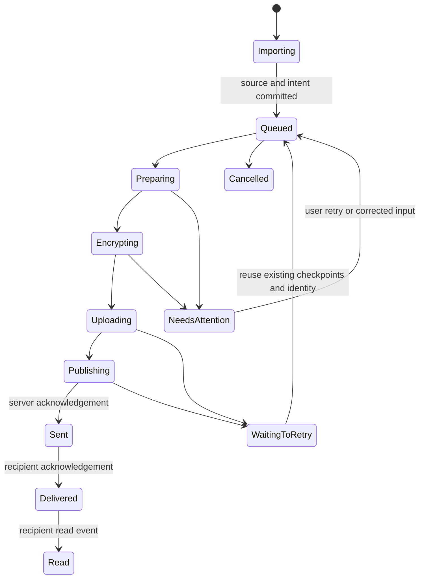

# Chitthi attachment delivery audit

## Release compatibility — 2026-09-18

The release advertises `receipts=explicit` from updated mobile history/poll requests. Installed iOS/Android clients without that capability retain their existing thread-open acknowledgements until upgraded. This avoids leaving old clients permanently unread during the backend/native-build rollout. The compatibility case has a dedicated regression test. Backend release marker: `chitthi-durable-outbox-v11`; internal mobile builds: iOS 53 and Android 31.

## Second layer-by-layer review — 2026-09-18

The follow-up review found and fixed additional boundary failures:

| Layer | Finding and correction | Evidence |
| --- | --- | --- |
| Selection and composer | Late picker results could enter a different account/conversation. Camera capture replaced an existing mixed selection. Picker context guards now discard stale results; camera appends within the batch limit. | Executed screen-handler tests for all three pickers and camera append. |
| Durable records | A malformed checkpoint or failed error-state write could stop later items. Stale controls could change a sent job back to queued/cancelled. Checkpoint reconstruction isolates damaged items; sent state is terminal. | Corrupt/unwritable checkpoint and stale-action tests. |
| Outbox/upload handoff | Validated the real source-outbox and upload-queue implementations together, including server acceptance followed by a lost response or failed local checkpoint. | Runtime restart/cache-eviction integration tests retain one server message and the original client ID. |
| Forwarding | A timed-out accepted forward could be falsely cancelled. Server retry required the original source to remain available. Persisted ambiguous-publication state now prevents false cancellation; server returns the existing accepted message before checking an expired source. | Lost-response/restart/cancel test and real database forwarding/expiry test. |
| Server publication | Concurrent authorizations could race the initial idempotency lookup and replace accepted ciphertext while retaining earlier envelopes. Publication now locks and repeats the lookup after remote verification; membership/block checks repeat inside that transaction. | Two simultaneous finalizations with distinct ciphertext return one identical message/object; removing membership during verification rejects publication. |
| Encryption/receiving | Browser decryption supported current V3 but omitted historical V2 chunked files. Both authenticated formats now decode correctly. | Actual NaCl envelope/attachment cryptography, file and browser V2 round trips at chunk boundaries, independent AES-GCM V3 vectors, wrong-key/tamper/truncation/reordered-chunk rejection. The native OS crypto modules were inspected, not executed by these tests. |
| Local acceptance/UI | An identity-store or UI-observer failure after server acceptance could turn a send into an error. Acceptance now precedes optional local decryption; observers cannot fail durable state transitions. | Fault injection after acceptance. |
| Receipts/lifecycle | Backgrounding while delivery acknowledgement was pending could still issue a read acknowledgement. Every acknowledgement batch now rechecks app/account/conversation state. | Executed receipt-effect test and the complete server chat suite. |

Latest verification: **92 chat tests and 22 R2 storage tests pass**. The mobile media command passes 14 source-outbox/integration scenarios, the recovery-service scenario, 23 upload cases, draft recovery checks, seven workflow scenarios, and three groups of actual cryptography checks. TypeScript and the existing encrypted-message presentation regression pass. Tests use temporary databases, fake object storage/network boundaries, and in-memory mobile filesystems; they do not send real user messages.

Remaining gaps are explicit: native background/force-quit and low-storage behavior still need physical-device runs; preparation/transfer is serial; browser composer binaries are not generally durable across reload; app-container path relocation has not been certified. Delivery acknowledgement currently follows conversation hydration, so unopened conversations can show delayed delivery ticks. Retention policy and the absence of a new Android persistent background publication worker are unchanged. These checks do **not** establish full WhatsApp parity or certify every device/OS lifecycle.

## Implementation update — 2026-09-18

The findings below describe the **pre-implementation audit**. The following fixes have since been implemented in the working tree:

- An application-owned attachment outbox persists every item before importing sources, then checkpoints preparation, encryption, upload, and server acceptance. Native source and encrypted files live in durable app storage. Reopening the app resumes eligible work without mounting Messenger. Existing drafts and encrypted upload records are migrated/recovered.
- The native composer waits for source import and rejects duplicate Send taps. Failed items remain visible with their own retry/cancel actions. A bad item does not discard healthy siblings. Interrupted temporary copies can be replaced safely. Retries retain the original publication ID, including a lost server response and renewed upload authorization.
- Multiple documents and mixed photo/video selections can be appended, removed, and reordered. Received mixed albums preserve their positions and provide video playback. Forwarding records each destination before sending, so successful destinations are not repeated when another destination fails. Legacy browser attachments are encrypted before forwarding intent is persisted; browser storage quota errors remain explicit.
- Message delivery and read receipts now use explicit, per-message, per-recipient acknowledgements. Fetching history no longer marks messages read. The client acknowledges visible messages while active; group ticks require all snapshotted recipients. Migration preserves known historical readers without converting one group's shared timestamp into an acknowledgement from everyone.
- Backend finalization recognizes the same client message ID even under a new upload authorization, preserving the original attachment and encryption envelopes.

Verification completed during implementation: the media regression command (nine source-outbox scenarios, including interrupted legacy migration; the application recovery service; 23 upload recovery cases; draft recovery; and four composer/browser workflow checks), TypeScript, and encryption regression checks pass. Backend coverage included the complete chat suite; its one obsolete GET-implies-read expectation was updated and all 19 person-thread tests passed on rerun. All 26 realtime/receipt tests, 22 R2 tests, and 25 community tests passed. The iOS JavaScript bundle also exported successfully. Native boundaries in the JavaScript recovery tests are mocked; these are not physical-device results.

Remaining limits: preparation/upload scheduling is serial, so a large video can delay later photos; a failed item is isolated. No new Android background worker or native message-publication service was introduced. Recovery resumes when the app is active, and existing supported native upload facilities retain their OS limits. Browser composer binaries are not generally durable across reload. Cancellation during ambiguous server acceptance is deliberately refused. Mixed albums do not yet provide a unified photo/video swipe viewer. Media retention is unchanged. Device lifecycle, low-storage, and UI scenarios in the release-gate table below still need real-device validation. The backend and client receipt changes should be released together.

## Original audit

Reviewed 2026-09-18 against the current working tree, including the pending media-recovery changes. Scope: one attachment, mixed batches, multiple destination chats, sender lifecycle, receiving, receipts, and retention. This is a code and automated-test audit; physical-device lifecycle behavior has not been certified.

## Conclusion

Chitthi has a substantially stronger native upload queue now, but does **not yet meet a complete durable messaging contract**. The original symptoms can arise at different boundaries: losing source selections before they are persisted, restoring unfinished preparation only as a draft, recovery waiting for the messenger screen, and partial multi-destination forwarding. An upload queue alone cannot address all of those boundaries.

The most important remaining work is an application-owned, persistent attachment outbox covering preparation through publication, with the UI rendered from that outbox. Receipt correctness needs a separate server/client change.

## What established apps actually document

These are separate references, not evidence that all messengers use identical internals:

- **WhatsApp observable behavior:** sent, delivered to a recipient phone/linked device, and read are distinct states. Group double checks require all recipients. Its private queue schema and scheduling implementation cannot be inferred from these indicators. [Official receipts documentation](https://faq.whatsapp.com/665923838265756/).
- **Signal attachment transport:** encrypt the attachment, upload it, then deliver the location and decryption key inside an encrypted message. The uploaded object can serve multiple linked devices. This supports separating blob transport from message publication. [Signal architecture explanation, January 2025](https://signal.org/blog/a-synchronized-start-for-linked-devices/).
- **Signal Android job ownership:** its open-source JobManager has persistent job storage, application-level initialization, job dependencies, and platform/in-process scheduling. The compression job serializes attachment identity and updates database transfer state. These are concrete implementation references, not claims about WhatsApp's source. [JobManager](https://github.com/signalapp/Signal-Android/blob/main/app/src/main/java/org/thoughtcrime/securesms/jobmanager/JobManager.java), [AttachmentCompressionJob](https://github.com/signalapp/Signal-Android/blob/main/app/src/main/java/org/thoughtcrime/securesms/jobs/AttachmentCompressionJob.java). These links track a moving branch.
- **Telegram album UX:** its published attachment preview supports mixed photos/videos and rearranging/removing selected items. Its upload API separates numbered file parts from publishing media and albums. This is a useful UX/transport reference, not proof of equivalent encryption or background guarantees. [Attachment preview](https://telegram.org/blog/downloads-attachments-streaming), [File API](https://core.telegram.org/api/files).
- **OS boundary:** iOS background file transfers can operate outside the app process, but force-quitting from the multitasking screen cancels them and prevents automatic relaunch. Android recommends persistent work mechanisms for work that should survive app restarts. No messenger should promise unrestricted execution after force-stop. [Apple](https://developer.apple.com/documentation/foundation/urlsessionconfiguration/background(withidentifier:)), [Android](https://developer.android.com/develop/background-work).

## Required product contract

The following is the proposed Chitthi contract, rather than an assertion about undocumented competitor behavior:

1. Every accepted attachment gets a stable local identity, destination, batch position, caption policy, and durable source reference.
2. The composer clears only after durable acceptance. During source import, show “Saving attachments”; a crash must leave an explicit incomplete import record rather than silently forget selected items. A manifest alone cannot recover inaccessible source bytes: durable import or retained source access is necessary.
3. Once accepted, navigating away or restarting cannot remove the pending message. Reopening reconstructs its bubble and resumes eligible work without asking the user to recreate the send.
4. Every file has independent preparation, transfer, retry, cancellation, and error state. A damaged photo must not indefinitely block healthy siblings. Album presentation preserves the original order even if network completion differs.
5. Upload completion means bytes reached storage. “Sent” requires server message acceptance. “Delivered” requires recipient acknowledgement. “Read” requires the appropriate visible/read event. Full-media download is a separate state.
6. Network retries reuse the same message identity. A timeout after acceptance must not create duplicates. Permanent failures remain visible and actionable.
7. A multi-chat send tracks each destination independently. Completed destinations stay completed when failed destinations retry.

Cancellation during publication must reconcile server acceptance before claiming the message was never sent. A restarted job resumes its saved stage; it need not repeat encryption or uploaded parts.

## Layer-by-layer findings

Paths below are relative to the repository; line numbers refer to this reviewed working tree.

| Layer | Current Chitthi behavior | Assessment |
| --- | --- | --- |
| Selection | Mixed photo/video picker accepts up to 20. Documents use a restricted MIME list and `multiple: false`. | Mixed media supported; multiple documents in one picker selection are not. `mobile/src/utils/fileUpload.ts:13`; `mobile/src/utils/imageUpload.ts`. |
| Preview and grouping | Shared caption is assigned to the first item; batch IDs and positions are carried in encrypted metadata. The rendered collage groups `IMAGE` only. | A photo/video selection does not become one mixed album. No album reorder control located. `MessengerScreen.tsx:2347`, `:4595`. |
| Durable acceptance | Raw source drafts copy into Documents, then each metadata record is saved. Sources are saved sequentially after optimistic rows appear and the composer clears. | Per-item recovery exists, but a process death during import can leave only a prefix persisted. There is no durable complete batch manifest/acceptance transaction. `MessengerScreen.tsx:4677`; `chatMediaDrafts.ts`. |
| Preparation | Resolved derivatives are preserved and rejected preparation promises are removed for retry. Native preparation/encryption queues the batch before uploading. | A preparation failure still interrupts the batch; a large video also delays ready photos. Upload-failure isolation is stronger than preparation-failure isolation. `MessengerScreen.tsx:4690`, `:4992`. |
| Encryption and identity | Encrypted file plus recipient envelopes; owner/conversation-scoped queue; account-change guards; recipient envelope refresh for changed keys. | Useful transport foundations. This is not a protocol/security-equivalence audit. Key refresh must not be confused with Signal safety-number trust decisions. |
| Local confidentiality | Encrypted outgoing copies are durable. Source drafts and captions are stored as source files/JSON within app storage. | Durable storage does not imply application-level encryption of every local draft. Platform file protection and backup policy need a separate review. `chatMediaDrafts.ts`. |
| Upload and publish | Small single uploads and large multipart uploads use durable native queue records, stable IDs, receipt checkpoints, authorization renewal, and concurrency guards. | Strongest layer after the recovery fixes; automated failure-injection coverage exists. `client.ts:1978`, `:2188`. |
| Lifecycle ownership | Resume timer belongs to `MessengerScreen`, runs while active, and starts after roughly 15 seconds. `App.tsx:3077` keeps that screen mounted for active transfers. | Not an app-wide worker: a cold start outside Messenger does not mount this recovery effect. Source-only drafts restore to the composer and require Send again. `MessengerScreen.tsx:2753`, `:3250`. |
| Native background | iOS coordinator schedules file-backed multipart PUTs with a stable background session and reconnect hook. Its callbacks resolve in-memory continuations; JavaScript still orchestrates publication. | Background byte transport exists, but that is not a complete native send pipeline. No app-owned Android WorkManager/worker equivalent was located in the searched native modules/Android/plugins. `FairFaresBackgroundUploadCoordinator.swift:12`. |
| Retry and controls | Queued uploads retry during foreground recovery; failed uploads do not strand later queued files. Raw drafts remain recoverable. | No persisted media retry schedule/backoff or complete permanent-error UX. Pending bubble reconstruction and per-file controls are incomplete; batch cancellation is restricted. A saved-upload count is not a substitute for each pending message. |
| Multiple destinations | Forwarding reuses an existing encrypted attachment reference and re-encrypts its descriptor for destination devices. | Efficient reuse, but destination loops are not a durable forwarding job matrix. One error exits the outer operation; completed destinations are not recorded as a resumable user operation. `MessengerScreen.tsx:7067`, `:7126`. |
| Delivery/read receipts | Chat-page fetch and polling set both `delivered_at` and `read_at` on shared message rows. | Confirmed semantic gap: fetching is not proof of successful client decryption/display. One group member can set the shared read timestamp; it does not mean every member read the message. `app.py:27996`, `:28157`, `:22138`. |
| Receive/download | Encrypted downloads pass expected size/checksum to the download helper, decrypt to persistent local media, and acknowledge native download after a durable file exists. Browser memory-only data does not trigger that acknowledgement. | Good separation of full-media download from thumbnail preview. This acknowledgement is separate from the problematic delivered/read timestamps. `MessengerScreen.tsx:6504`, `:6555`. |
| Retention | Configured defaults are 7 days for attachment storage and 2 days for large video. Local media cleanup has 500 MB and 90-day limits. | Product policy can make old media unavailable after local eviction; durable send recovery is not permanent attachment history. Review expiry UX and explicit save/export. `app.py:142`; `chitthiMediaStorage.ts:5`. |
| Browser | Prepare/upload is sequential to limit memory. Pending payloads are not persisted across reload. | Native recovery guarantees must not be advertised for web. |

## Relating the findings to the reported symptoms

**“Only the video sends.”** Previously, photos could depend on transient preparation/state while the video ran. The recovery changes persist native work and isolate individual upload failures. Remaining boundaries include interrupted source import and a single preparation failure blocking the batch. The passing upload tests do not prove all selection/preparation failures are solved.

**“I exit and return and nothing was sent.”** There are several distinct cases:

- Already encrypted/queued: recovery can resume when Messenger is mounted and active.
- Source saved but not queued: currently restores as a draft, requiring another Send.
- Process stopped during sequential source import: later selections might not have reached durable storage.
- Background multipart transfer: uploaded bytes can exist without a published chat message until finalization runs.
- Force quit: OS transfer restrictions apply; the necessary guarantee is preserved intent and correct recovery on reopening.
- Forward to several chats: no durable operation records which destinations remain.

These are code-supported failure windows, not a claim to have reproduced the user's exact device sequence.

## Implementation order

1. **Durable outbox and visible recovery:** introduce persistent batch/item records covering import through publication. Rehydrate bubbles from these records. Preserve existing upload IDs and migrate existing drafts/queue entries. Keep screen components as observers/controllers rather than owners of network work.
2. **Independent workers:** bounded preparation/encryption/transfer concurrency; checkpoint each stage; one expensive video transcode at a time; allow unrelated photos/files to progress. Persist retry classification, attempt count, next-attempt time, and actionable terminal errors.
3. **Lifecycle integration:** initialize recovery at authenticated app startup; connect supported native background scheduling. Reconcile iOS upload completion with server parts and publication after relaunch. Validate Android scheduling constraints on real devices.
4. **Receipt correction:** separate per-recipient delivery/read state from media-download receipts. Send acknowledgements from explicit client events. Derive group aggregate ticks from the intended recipient set; define membership-change behavior and migrate old ambiguous timestamps conservatively.
5. **Batch UX and forwarding:** mixed album display/order; multi-document selection where desired; per-item retry/cancel; persisted per-destination forwarding completion and idempotency.
6. **Storage policy:** communicate expiry, provide explicit save/export, and audit raw-draft protection/backup behavior. Do not promise permanent media availability under the current cleanup policy.

This sequence is a recommendation, not a claim that these remaining architectural changes have been implemented.

## Verification and release gate

Automated checks run during this investigation:

- `npm run test:media-recovery`: upload persistence/restart, mixed queues, failure isolation, lost server responses, live/recovery races, cancellation, account isolation, expired authorization, key changes, source-draft restoration, and send workflow checks. The native/filesystem/network boundaries are mocked.
- `npm run test:chitthi-encryption` and `npm run typecheck`.
- Earlier in this investigation, the R2 storage and chat realtime Python suites passed (45 tests total). They were not rerun for this documentation-only audit.

The following remain physical-device/integration release gates, not completed tests:

| Scenario | Required result |
| --- | --- |
| One image, video, document; then 20 mixed items | Every accepted item has a visible, independent outcome. |
| Bad image or video in first/middle/last position | Healthy items progress; bad item remains retryable with a useful error. |
| Kill during source copy, encryption, part upload, and after server acceptance | No silent disappearance; no duplicate publication; recover the correct stage. |
| Background, screen lock, system termination, user force quit, reopen outside Messenger | Behavior respects OS limits; accepted work remains visible and resumes when allowed. |
| Offline send, network switch, expired URL, low storage | Persisted work survives; errors are classified; recovery does not spin indefinitely. |
| Forward several messages to three chats; fail chat two | Chats already completed do not duplicate; pending destinations remain independently retryable. |
| Group with three recipients, only one opens chat | Aggregate read status does not claim all members read. |
| Logout/account switch during preparation and upload | Work never sends using another account; original account work remains isolated. |
| Cloud expiry followed by local cleanup | UI explains unavailable media and does not suggest retry can restore deleted bytes. |

Passing the current regression scripts establishes the covered recovery mechanics. It does not establish full WhatsApp/Signal parity or certify iOS/Android force-quit behavior.
